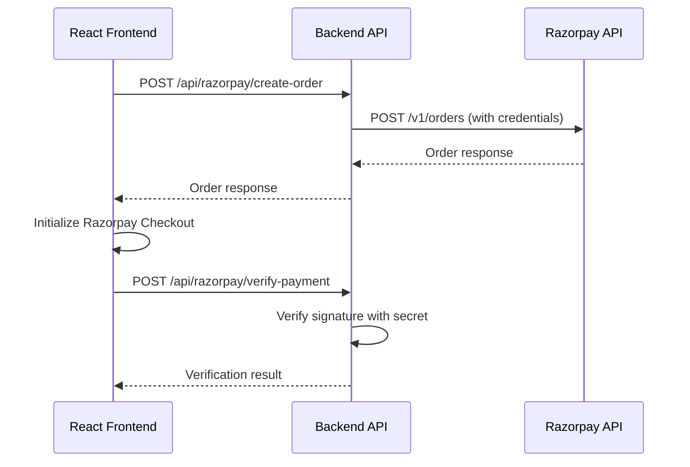

# Design Document: Razorpay Payment Fix

## Overview

This design addresses the CORS issue in the Razorpay payment integration by ensuring all payment-related API calls are properly routed through the backend API endpoints instead of making direct calls to Razorpay's servers from the frontend.

The core issue is that the frontend is attempting to make direct XMLHttpRequests to `https://api.razorpay.com/v1/orders`, which violates CORS policy. The solution involves fixing the API service configuration and ensuring proper environment setup.

## Architecture



## Components and Interfaces

### API Service Layer
- **Location**: `src/services/apiService.ts`
- **Purpose**: Centralized service for making API calls to backend endpoints
- **Key Methods**:
  - `createOrder(paymentRequest)`: Creates payment order via backend
  - `verifyPayment(verification)`: Verifies payment via backend

### Backend API Endpoints
- **Location**: `api/razorpay/create-order.js` and `api/razorpay/verify-payment.js`
- **Purpose**: Proxy requests to Razorpay API with server-side credentials
- **Security**: Uses server-side environment variables for API keys

### Environment Configuration
- **Frontend**: Uses `VITE_RAZORPAY_KEY_ID` for Razorpay checkout initialization
- **Backend**: Uses `RAZORPAY_KEY_ID` and `RAZORPAY_KEY_SECRET` for API operations

## Data Models

### Payment Request
```typescript
interface PaymentRequest {
  amount: number;        // Amount in paise (smallest currency unit)
  currency: string;      // Currency code (e.g., 'INR')
  receipt: string;       // Unique receipt identifier
  notes?: Record<string, string>; // Additional metadata
}
```

### Payment Verification
```typescript
interface PaymentVerification {
  orderId: string;       // Razorpay order ID
  paymentId: string;     // Razorpay payment ID
  signature: string;     // Payment signature for verification
}
```

### API Response
```typescript
interface APIResponse<T> {
  success: boolean;
  data?: T;
  error?: string;
}
```

## Correctness Properties

*A property is a characteristic or behavior that should hold true across all valid executions of a system-essentially, a formal statement about what the system should do. Properties serve as the bridge between human-readable specifications and machine-verifiable correctness guarantees.*

### Property 1: API Endpoint Routing
*For any* payment-related request (order creation or verification), the frontend should route the request to the correct backend API endpoint and never directly to Razorpay's external API
**Validates: Requirements 1.1, 1.3, 1.4, 4.1, 5.1**

### Property 2: Backend Proxy Behavior
*For any* order creation request received by the backend, the backend should proxy it to Razorpay's API using server-side credentials and return the response
**Validates: Requirements 1.2, 4.2, 4.3**

### Property 3: Environment Configuration
*For any* environment (development or production), the API service should use the correct base URL and the system should load the appropriate Razorpay credentials
**Validates: Requirements 2.1, 2.2, 2.3, 3.1, 3.2, 3.3**

### Property 4: Payment Signature Verification
*For any* payment verification request with signature data, the backend should validate the signature using the secret key and return the correct verification status format
**Validates: Requirements 5.2, 5.3, 5.4**

### Property 5: Error Handling
*For any* network failure or invalid input, the system should provide appropriate error messages and handle failures gracefully
**Validates: Requirements 2.4, 3.4, 4.4**

## Error Handling

### Network Errors
- API service should catch network failures and provide user-friendly error messages
- Implement retry logic for transient failures
- Log detailed error information for debugging

### Validation Errors
- Backend should validate all incoming request parameters
- Return specific error messages for missing or invalid data
- Frontend should display validation errors to users

### Environment Configuration Errors
- System should detect missing environment variables at startup
- Provide clear error messages indicating which variables are missing
- Fail fast if critical configuration is unavailable

## Testing Strategy

### Unit Tests
- Test API service methods with mocked responses
- Test backend endpoint handlers with various input scenarios
- Test error handling for network failures and invalid inputs
- Verify environment variable loading and validation

### Property-Based Tests
- Generate random payment requests and verify they're routed correctly
- Test payment verification with various signature combinations
- Verify error handling across different failure scenarios
- Test environment configuration with different variable combinations

**Testing Framework**: Jest for unit tests, fast-check for property-based testing
**Test Configuration**: Minimum 100 iterations per property test
**Test Tagging**: Each property test tagged with **Feature: razorpay-payment-fix, Property {number}: {property_text}**